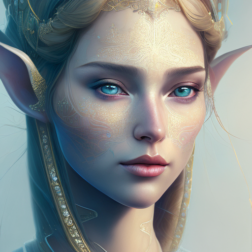
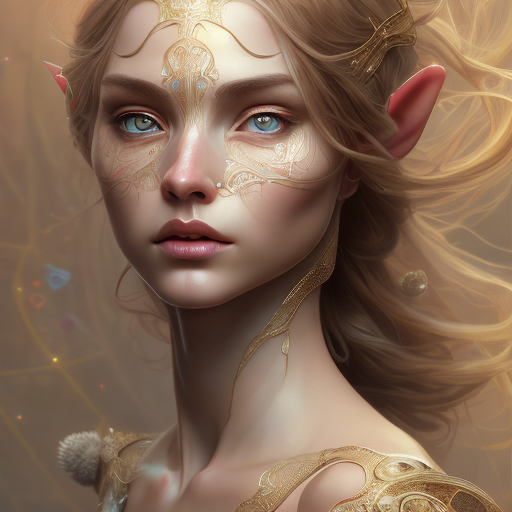

# Midjourney Client

A minimal client for Openjourney's hosted inference API on replicate. This package allows you to easily integrate Midjourney/Openjourney into your code.

> Openjourney is an open source Stable Diffusion fine tuned model on Midjourney images, by [PromptHero](https://prompthero.com/). Predictions run on Nvidia A100 GPU hardware.




## Installation

```js
npm i midjourney-client
```


## API

The API is super simple; just enter your prompt and `await` for the generated image URLs. One image is returned by default.

```js
await midjourney('a painting of a ginger cat.')
```

Pass in additional parameters.

```js
await midjourney('a painting of a ginger cat.', { width: 1024 })
```

A complete list of supported parameters can be found [here](https://replicate.com/prompthero/openjourney/api).


## Examples

> portrait of female elf, intricate, elegant, highly detailed, digital painting, artstation, concept art, smooth, sharp focus, illustration, art by artgerm and greg rutkowski and alphonse mucha, 8k.



> whimsical fantasy elegant rose floral botany maximalism with a wave of flowers garden flowing flowers floating in misty soft pink, aqua, soft apricot, smoke fractal, moody and big scale realistic flowers, octane render, by josephine wall art, isabelle menin, Jean, amy brown.


## Future

- Improve API interfaces (i.e. return richer objects than just arrays of URLs).
